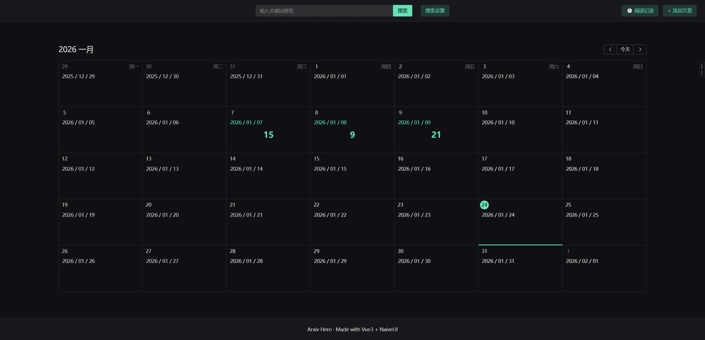
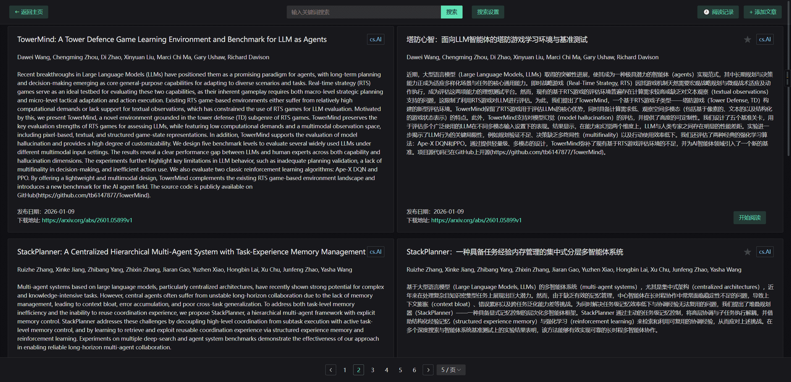
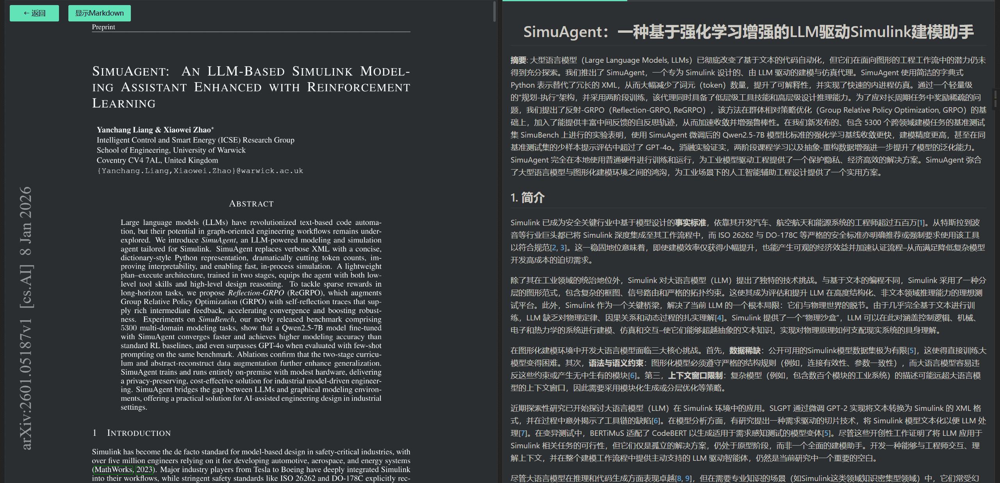

<div align="center">
<h1> ArxivHero </h1>

[](LICENSE)
[](https://www.python.org/downloads/release/python-3120/)
[](https://vuejs.org/)
[](https://github.com/Mr-nnng/ArxivHero)
</div>

一款轻量、易用的 Arxiv 论文追踪与英译中翻译工具，旨在降低学术论文阅读门槛，帮助研究者快速获取 Arxiv 最新论文并查看中文翻译版本。

## 🌟 核心特性
- 论文管理：支持自定义 Arxiv 学科分类，需手动拉取最新论文列表，支持搜索、收藏和自定义添加文章，会保留阅读记录，方便接续阅读；
- 阅读界面：内置 Web 前端页面，原文有pdf和md两种阅读模式，译文是基于latex原文翻译的md；
- 后台翻译：一键生成论文的英译中翻译内容，后台解析和翻译，流式输出；
- 跨平台：兼容 Windows/Linux/Mac 系统。

## 📋 环境要求
### 后端
- Python 3.12 及以上版本
- pip（Python 包管理工具）

### 前端
- Node.js 14 及以上版本
- npm/yarn（前端包管理工具）

## 📂 仓库文件结构
```
ArxivHero/
├── .gitignore                      # Git 忽略规则配置
├── README.md                       # 仓库说明文档（本文）
├── config.toml.example             # 配置文件示例（需复制重命名为config.toml）
├── main.py                         # 后端主程序入口，端口在这里修改
├── start.bat                       # Windows 一键启动脚本
├── requirements.txt                # 后端依赖清单
├── arxiv_hero/                     # 后端核心业务逻辑目录
│   ├── common/                     # 通用基础组件（如常量、枚举）
│   ├── config/                     # 配置解析与加载模块
│   ├── controllers/                # 接口控制层（处理前端请求）
│   ├── models/                     # 数据模型（如论文、翻译结果）
│   ├── repositories/               # 数据访问层（论文/翻译数据读写）
│   |   ├── article_repository/     # 访问论文题目及摘要数据
│   |   ├── content_repository/     # 访问论文正文数据
│   |   └── history_repository/     # 访问阅读记录
│   ├── services/                   # 核心服务层（论文获取、翻译、追踪）
│   |   ├── article_services/       # 获取和翻译论文题目及摘要
│   |   |   ├── fetcher.py          # 从 arxiv 获取论文
│   |   |   ├── prompts.py          # 翻译论文题目和摘要的提示词，可自行修改
│   |   |   └── translator.py       # 翻译论文题目和摘要
│   |   └── content_services/       # 获取和翻译论文正文
│   |   |   ├── latex_parser.py     # 解析 .tex 格式的文章正文
│   |   |   ├── processor.py        # 下载、翻译正文
│   |   |   ├── prompts.py          # 翻译论文正文的提示词，可自行修改
│   |   |   ├── protocol.py         # content_services 中使用的数据类
│   |   |   ├── translator.py       # 翻译正文，供 processor 调用
│   |   |   └── utils.py            # 辅助工具
│   └── utils/                      # 公共工具函数（大模型交互、多线程）
├── tests/                          # 单元测试目录
│   ├── test_chat_utils.py          # 翻译工具测试用例
│   └── test_config.py              # 配置模块测试用例
└── web_ui/arxiv_hero/              # 前端代码目录
    ├── public/                     # 前端静态资源（图片、样式、字体）
    ├── src/                        # 前端源码（组件、路由、接口请求）
    │   ├── App.vue                 # Vue 根组件
    │   ├── interfaces.ts           # TypeScript 接口定义
    │   ├── main.ts                 # Vue 应用入口
    │   ├── style.css               # 全局样式
    │   ├── vite-env.d.ts           # Vite 环境类型声明
    │   ├── assets/                 # 静态资源目录
    │   ├── components/             # Vue 组件目录
    │   │   ├── AddArticle.vue      # 添加论文组件
    │   │   ├── ArticleCard.vue     # 论文卡片组件
    │   │   ├── ArticleList.vue     # 论文列表组件
    │   │   ├── Calendar.vue        # 日历组件（阅读统计）
    │   │   ├── ContentViewer.vue   # 正文查看器组件
    │   │   ├── Header.vue          # 页面头部组件
    │   │   ├── HistoryList.vue     # 阅读历史列表组件
    │   │   ├── MarkdownRender.vue  # Markdown 渲染组件
    │   │   └── TranslateView.vue   # 翻译视图组件
    │   ├── pages/                  # 页面组件目录
    │   │   ├── Article.vue         # 论文详情页面
    │   │   ├── Content.vue         # 论文正文页面
    │   │   └── Home.vue            # 首页   
    │   ├── router/                 # 路由配置目录
    │   │   └── index.ts            # 路由配置
    │   ├── services/               # 前端服务层（API 请求）
    │   │   ├── article.ts          # 论文相关 API
    │   │   ├── content.ts          # 论文正文相关 API
    │   │   └── history.ts          # 阅读历史相关 API
    │   ├── stores/                 # 状态管理目录
    │   │   └── useSearchStore.ts   # 搜索状态管理
    │   └── utils/                  # 前端工具函数
    │       ├── checker.ts          # 校验工具
    │       ├── markdownRender.ts   # Markdown 渲染工具
    │       ├── request.ts          # HTTP 请求封装
    │       ├── stream.ts           # 流式处理工具
    │       └── tools.ts            # 通用工具函数
    ├── package.json                # 前端依赖清单
    └── vite.config.js              # 前端构建配置
```

## 🚀 使用说明
### 1. 克隆仓库
```bash
# 通过 Git 克隆（推荐）
git clone https://github.com/Mr-nnng/ArxivHero.git
cd ArxivHero

# 若未安装 Git，直接下载仓库压缩包并解压，进入解压后的目录
```

### 2. 环境搭建
#### 2.1 后端环境配置
```bash
# 安装后端依赖
pip install -r requirements.txt

# 若安装失败，可手动安装核心依赖（兜底方案）
pip install arxiv requests translate flask python-dotenv toml
```

#### 2.2 前端环境配置（仅本地开发/调试前端时需执行）
```bash
# 进入前端目录
cd web_ui

# 安装前端依赖（npm 方式）
npm install

# 或 yarn 方式
yarn install
```

### 3. 配置项目参数
1. 复制后端配置示例文件并命名为 `config.toml`：
   - Windows 命令行：`copy config.toml.example config.toml`
   - Linux/Mac：`cp config.toml.example config.toml`
2. 编辑 `config.toml` 文件，根据注释配置以下核心参数：
   ```toml
   # openai格式的大模型配置
    [openai]
    api_key = "sk-xxx"
    base_url = "https://api.siliconflow.cn/v1"
    model = "Qwen/Qwen2.5-7B-Instruct"
    max_retries = 3
    wait_time = 30 # 被大模型服务拒绝后的等待时间，单位是秒

    # sqlite数据库，推荐的默认配置，和mysql二选一即可
    [sqlite]
    path = ".db/arxiv_hero.db" # 存放路径

    # mysql数据库，如果两个都配置，会使用sqlite
    [mysql]
    host = "localhost"
    port = 3306
    user = "root"
    password = "xxx"        # 数据库密码
    database = "arxiv_hero" # 数据库表名

    # ❗重要，arxiv配置
    [arxiv]
    categories = ["cs.AI", "cs.CL"]   # 需要获取的分类，用","分隔的列表。全部分类可见 "https://arxiv.org/category_taxonomy"
    only_primary = true               # true表示只检索主分类是“categories”中的文章
    download_dir = "./.data/articles"


    # 时区
    [timezone]
    timezone = "Asia/Shanghai"

    # 翻译配置
    [translate]
    max_retries = 3 # 失败后最大重试次数
    max_workers = 5 # 同时翻译文章的数量
   ```
3. 复制前端环境变量示例文件并命名为 `.env`：
   - Windows 命令行：`cd web_ui/arxiv_hero && copy .env.example .env`
   - Linux/Mac：`cd web_ui/arxiv_hero && cp .env.example .env`
4. 编辑 `.env` 文件，URL是python后端服务的地址，例如：
   ```
   VITE_API_BASE_URL=http://127.0.0.1:4587
   ```

### 4. 启动服务
#### 4.1 快速启动（推荐，自动启动后端+前端）
- Windows 系统：双击仓库根目录的 `start.bat` 批处理文件，一键启动；
- Linux/Mac 系统：在仓库根目录执行以下命令：
  ```bash
  python main.py
  cd ./web_ui/arxiv_hero && npm run dev
  ```

#### 4.2 手动启动（适用于开发调试）
##### 步骤1：启动后端服务
```bash
# 进入仓库根目录
cd ArxivHero
# 启动后端
python main.py
# 启动成功后，终端会输出 "Server running on http://127.0.0.1:4587" 类似日志
```

##### 步骤2：启动前端服务（本地调试前端时）
```bash
# 进入前端目录
cd web_ui/arxiv_hero
# 启动前端开发服务器（npm 方式）
npm run dev
# 或 yarn 方式
yarn dev
# 启动成功后，终端会输出前端访问地址，如 "http://127.0.0.1:5173"
```

### 5. 使用工具
1. 打开浏览器，访问启动日志中的服务地址（默认：后端 `http://127.0.0.1:4587` / 前端 `http://127.0.0.1:5173`）；
2. 首页按照日期展示论文数量，若需要获取或查看某天的论文，点击日期即可；
   

3. `/articles`界面展示已拉取的 Arxiv 论文列表，支持按学科、发布时间筛选；
   
   
3. 点击`开始阅读`，进入正文阅读页面。
   

## ❓ 常见问题
1. **拉取论文列表或获取正文时间过久**
   - 原因：arxiv 服务器连接不通畅；
   - 解决：确认网络可访问 Arxiv 官网（需科学上网的地区请配置代理）。

2. **前端页面无法访问/加载失败**
   - 检查后端服务是否正常启动；
   - 若本地调试前端，确认前端依赖已安装，且前端服务端口未被占用。

3. **翻译功能无结果**
   - 检查 `config.toml` 中翻译服务配置是否正确；
   - 确保网络通畅（翻译服务依赖网络）；
   - 部分论文内容过长可能导致翻译超时，可减少单次翻译篇幅。

## 🚨 目前已知的BUG
1. latex 解析问题：由于翻译时的源文本来自`.tex`格式的文件，作者能力有限，不能覆盖多样的嵌套样式，解析错误和遗漏难以避免，一些复杂的嵌套结构会以latex原文的样式展示，将来会逐步修复；
2. 翻译问题：依赖大模型的能力，若该问题频繁发生，建议更换更强的大模型或者修改翻译的提示词(`./arxiv_hero/services/article_services/prompts.py`和`./arxiv_hero/services/content_services/prompts.py`)。

## 📄 许可证
本项目采用 MIT 许可证开源，详情见 LICENSE 文件。

## 🙏 致谢
- 感谢 Arxiv 提供的开放论文数据源；
- 感谢开源翻译库/API 提供商的支持。